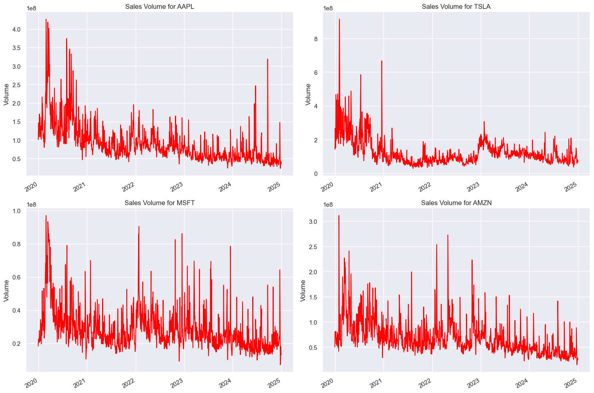

# 📊 Yahoo Finance Stock Market Analysis (AAPL, MSFT, AMZN, TSLA)  

## 🚀 Introduction  

Stock market prediction is a crucial area in financial analysis. Prices of stocks are influenced by various factors, such as market trends, economic indicators, and investor sentiment. This project focuses on analyzing and forecasting stock prices of **Apple (AAPL), Microsoft (MSFT), Amazon (AMZN), and Tesla (TSLA)** using deep learning.  

Using **Yahoo Finance data**, we apply **Exploratory Data Analysis (EDA), Feature Engineering, Preprocessing, and Long Short-Term Memory (LSTM) Regression modeling** to predict stock prices.  


---

## 🎯 Objectives  

✅ Retrieve stock market data using `yfinance` 📈  
✅ Perform **EDA** to visualize trends & correlations 📊  
✅ Extracting features like **RSI, MACD,Bollinger Bands, Moving Averages vs.**  
✅ Preprocess the data for deep learning (normalization, handling missing values)  
✅ Implement an **LSTM and Linear Regression models** for stock price forecasting 🧠  
✅ Evaluate predictions using **RMSE, and MAE scores**  
✅ Compare actual vs. predicted stock prices 📉  


---

## 🏗️ Project Workflow  

🔹 **Step 1:** Data Collection (Yahoo Finance API)  
🔹 **Step 2:** Exploratory Data Analysis (EDA)  
🔹 **Step 3:** Feature Engineering (Technical Indicators)  
🔹 **Step 4:** Data Preprocessing (Normalization, Reshaping)  
🔹 **Step 5:** LSTM & Linear Regression Models Training & Prediction  
🔹 **Step 6:** Model Evaluation (Error Metrics)  
🔹 **Step 7:** Results & Visualization  

---

## ⚙️ Installation & Setup  

### 📌 **1. Clone the Repository**  
```bash
git clone https://github.com/gamzeakkurt/deep-learning-stock-prediction.git
cd deep-learning-stock-prediction


```

### 📌 **2. Install Dependencies**  
```bash
pip install -r requirements.txt
```

### 📌 **3. Run the Python**  
```bash
python main.py
```
Open `main.py` and execute the code.

To run the full analysis and forecasting pipeline, execute the main.py file. This will sequentially:

- Load stock data from Yahoo Finance
- Perform exploratory data analysis (EDA)
- Process data with feature engineering and normalization
- Train and evaluate a Linear Regression model
- Train and evaluate an LSTM model
- Forecast future stock prices
- Visualize results and save predictions
---

## 📦 Dependencies  

The project requires the following libraries:  

```txt
yfinance
quantstats
ta
PyPortfolioOpt
pandas==1.3.5  
numpy  
matplotlib  
seaborn  
scikit-learn  
tensorflow  
keras
plotly  
```

You can install them using:  
```bash
pip install yfinance quantstats ta PyPortfolioOpt pandas numpy matplotlib seaborn scikit-learn tensorflow keras plotly
```

---

## 📊 Exploratory Data Analysis (EDA)  

✅ **Stock Price Trends:** Visualize historical stock prices over time  
✅ **Moving Averages & Indicators:** Compute SMA, EMA, RSI, and MACD  
✅ **Correlation Analysis:** Analyze relationships between different stocks  

🔍 **Example Visualization:**  

<p align="center">
  
</p>


---


## 🏗️ LSTM Model Architecture

The **BiLSTM (Bidirectional Long Short-Term Memory)** model used for stock price prediction follows the architecture below:

### **Model Overview**
- **Input Shape:** `(n_timesteps, 18)`  
  The input consists of sequences with `n_timesteps` (time steps) and 18 features for each time step.
  
- **LSTM Layers:**  
  - **3 stacked Bidirectional LSTM layers** with 64 units each.  
  The bidirectional nature allows the model to learn from both past and future data points.

- **Fully Connected Layer (Dense Layer):**  
  A Dense layer with 32 units and **ReLU activation** to learn complex patterns from the LSTM outputs.
  
- **Output Layer:**  
  A final **Dense layer** with 1 unit to predict the **'Close' price** of the stock.

### **Model Parameters**
- **Activation Function:**  
  - Hidden layers: **ReLU** activation  
  - Output layer: **Linear activation**
  
- **Optimizer:**  
  **Adam optimizer** for efficient training and learning.
  
- **Loss Function:**  
  **Huber loss** for robust training, balancing between Mean Squared Error (MSE) and Mean Absolute Error (MAE).


This architecture is designed to effectively capture complex patterns in time-series data, particularly for stock price forecasting.


---

## 📈 Results & Evaluation  

The model is evaluated using the following metrics:  

📌 **Root Mean Square Error (RMSE)**  
📌 **Mean Absolute Error (MAE)**  

🔍 **Example Prediction Plot:**  

<p align="center">


</p>


## 📄 Additional Information
All details regarding the code, including visualization, results, and interpretation, are available in the 'YahooFinanceStockMarketAnalysis-Report.pdf' document. You can download it for an in-depth understanding of the analysis and forecasting process.

---

## 📌 Future Improvements  

🔹 **Hyperparameter Optimization:** We will fine-tune model parameters to enhance predictive
accuracy and reduce errors.

🔹 **Model Comparison:** In addition to LSTM, we will evaluate and compare performance with
ARIMA, XGBoost, and CNN models to identify the most effective approach.

🔹 **Feature Expansion:** We plan to incorporate additional financial indicators and external
factors (e.g., market sentiment, economic trends) to improve model robustness.

🔹 **Hybrid Model Approach:** Combining LSTM with ARIMA, XGBoost, and CNN to
leverage both deep learning and traditional statistical methods for improved performance.


---

## 📜 License  

This project is licensed under the **MIT License**.  

---


## 📬 Contact  

For any questions or suggestions, feel free to reach out. 


